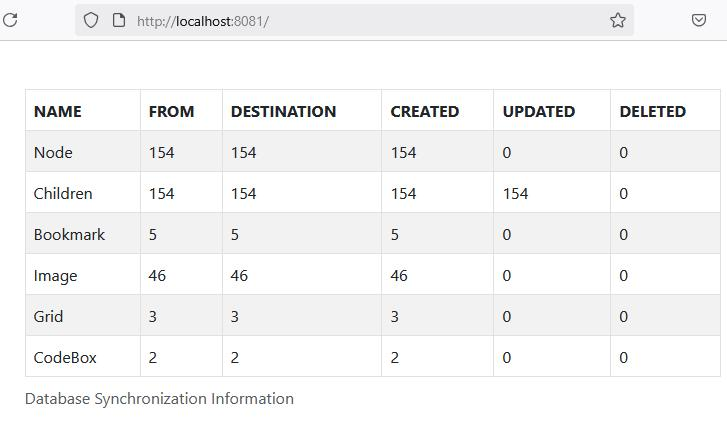
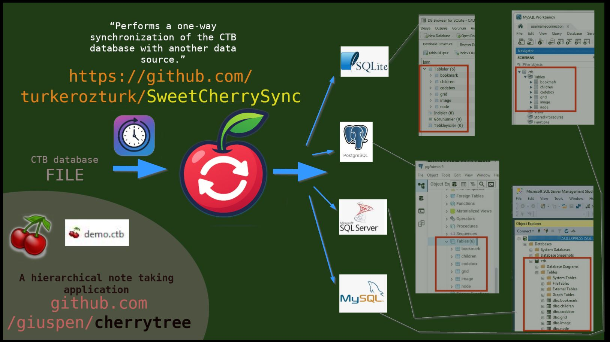

# SweetCherrySync

Developer: Türker Öztürk

License: GPL 3.0

CTB database with CherryTree Version 1.1.3 is supported (without any responsibility).

## Description

My unofficial software called SweetCherrySync is used to read data from the SQLite database file with the CTB extension of [CherryTree](https://github.com/giuspen/cherrytree) hierarchical note-taking software at regular intervals and then transfer changes such as creation, editing, and deletion to a second database specified as the target.

The target database can be located on the same computer or on a machine on the network.

The target database does not have to be SQLite. If there is a suitable database schema and library (I have prepared three additional types), it can be other database structures supported by the Java Spring Boot Framework.

## Purpose and Usage Scenarios

* It can be used for backup purposes. The time spent is shorter than copying the entire file.

* It can be used for remote read-only access. I developed a WebViewer as a separate project for this purpose and named it [SweetCherry](https://github.com/turkerozturk/SweetCherry). Thus, remote access is possible to read the notes.

* It is possible to collect different CTB databases in one center and keep them constantly up-to-date. For example, if the CTB files of several people are collected in one center, the notes they take can be observed by an authorized person in their current state.

## READ THE DOCUMENTS BELOW

Since some parts of the documents are created automatically, if there are unreadable parts, you can open and read the PDF version in the same folder in the source code.

[Technical Information & FAQ (EN)](src/docs/asciidoc/en/technicalinformation.adoc) | [PDF (EN)](src/docs/asciidoc/en/technicalinformation.pdf)

[Data Source Examples (EN)](src/docs/asciidoc/en/datasourceexamples.adoc) (You need this to connect to the datasources) | [PDF (EN)](src/docs/asciidoc/en/datasourceexamples.pdf)

[My General Installation Guide (EN)](src/docs/asciidoc/en/installation/installation.adoc) | [(TR)](src/docs/asciidoc/tr/installation/installation.adoc) | [PDF (EN)](src/docs/asciidoc/en/installation/installation.pdf)

[About (EN)](src/docs/asciidoc/en/about.adoc) | [PDF (EN)](src/docs/asciidoc/en/about.pdf)

## Screenshots

2025-04-15:

2025-05-18:

